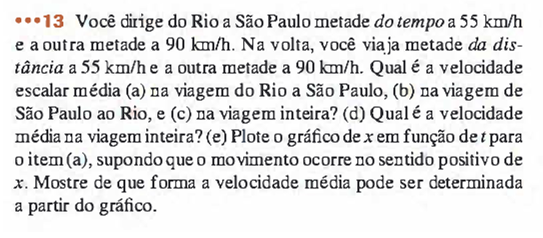
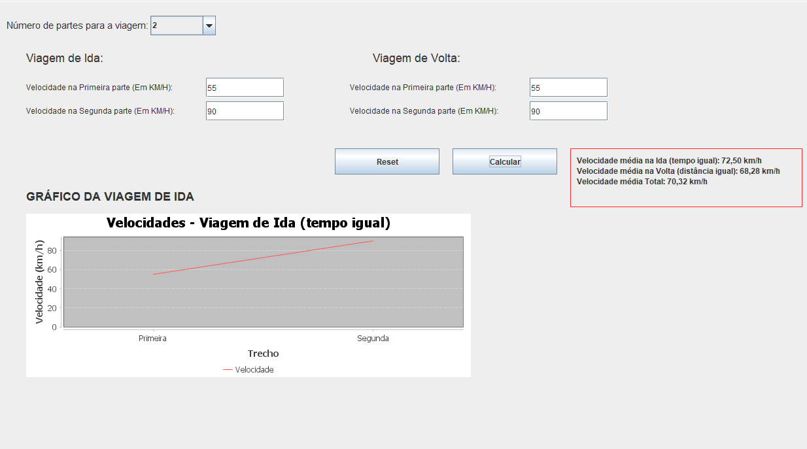

# AVERAGE-SPEED-GRAPHICS
Um programa feito para resolver o problema de alguém que pretende fazer uma viagem, e na rota de ida pretende usar velocidades diferentes por tempos iguais e na rota de volta pretende viajar metade da distância em uma velocidade e a outra metade em outra

# PROBLEMA ORIGINAL

# ALTERAÇÕES
O programa em cima tem como premissa replicar esse problema computacionalmente e desenvolve-lo para maiores complexidades, alterando sua estrutura para que assim, o usuário possa alterar em quantas partes ele vai dividir essa viagem de 2 partes, assim como no problema original até 10 partes

Assim também alterando a estrutura de gráfico o qual se adequa a quantas partes a viagem será divida
 
# APARÊNCIA DO PROGRAMA

# FUNÇÕES PRESENTES
Botão de reset e de calcular
Verificação de valores invalido (Valores negativos ou Valores < 0 || Valores > 310 ou letras e simbolo do alfabeto)
Mensagem de erro ao digitar os valores inválidos citados anteriormente
Representação gráfica da viagem de ida
A Representação Gráfica não existe a não ser que valores válidos sejam digitados
