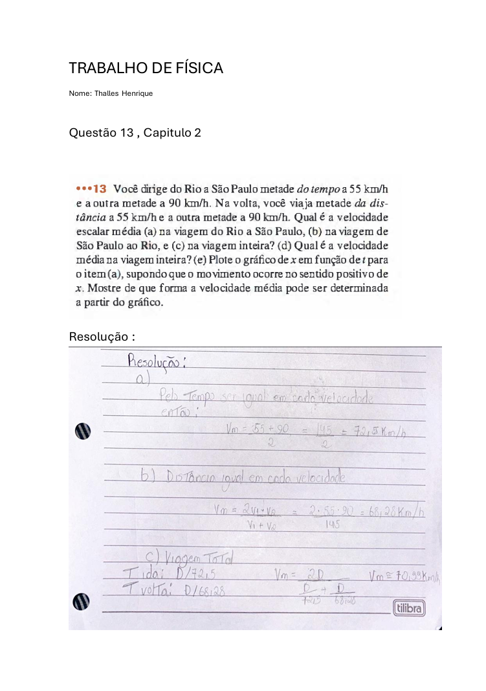
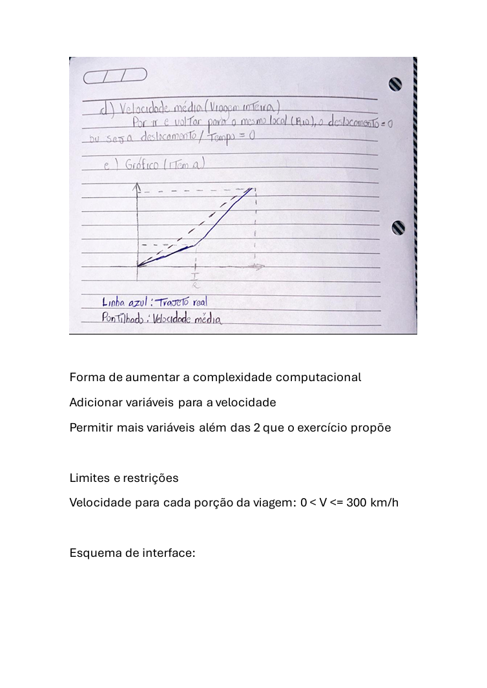
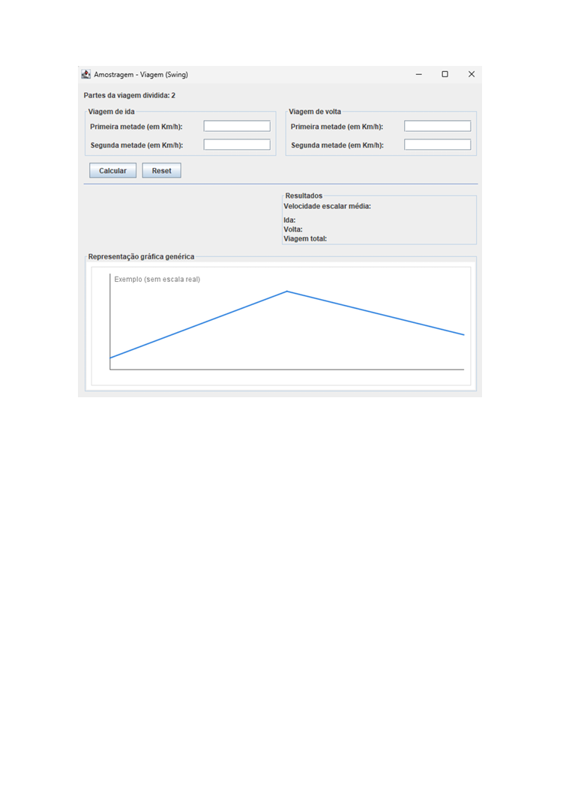

# AVERAGE-SPEED-GRAPHICS

Um programa feito para resolver o problema de alguém que pretende realizar uma viagem, utilizando diferentes velocidades em cada parte do trajeto.  
Na rota de ida, o usuário pode dividir a viagem em partes e informar velocidades diferentes (por tempos iguais); na volta, cada parte corresponde a uma fração igual da distância, e o usuário informa a velocidade em cada parte.

---

## PROBLEMA ORIGINAL

---

## ALTERAÇÕES E COMPLEXIDADE

O programa tem como premissa **replicar esse problema computacionalmente** e foi desenvolvido para permitir que o usuário escolha **em quantas partes** (de 2 até 10) a viagem será dividida, em vez das 2 partes do problema original.

Além disso, o **gráfico** gerado também se adapta automaticamente ao número de partes escolhidas para a viagem.

---

## APARÊNCIA DO PROGRAMA

---

## FUNÇÕES PRESENTES

- Botão de **Reset** e **Calcular**
- ✅ **Verificação de valores inválidos**  
   (Valores negativos ou valores fora do intervalo 0 < v ≤ 310, além de impedir letras e símbolos inválidos)
- ✅ **Mensagem de erro ao digitar valores inválidos**
- ✅ **Representação gráfica** da viagem de ida (apenas se todos os valores digitados são válidos)
- ✅ **A representação gráfica só aparece com dados válidos**

---

## PRÉ-PROJETO ORIGINAL

  

---
